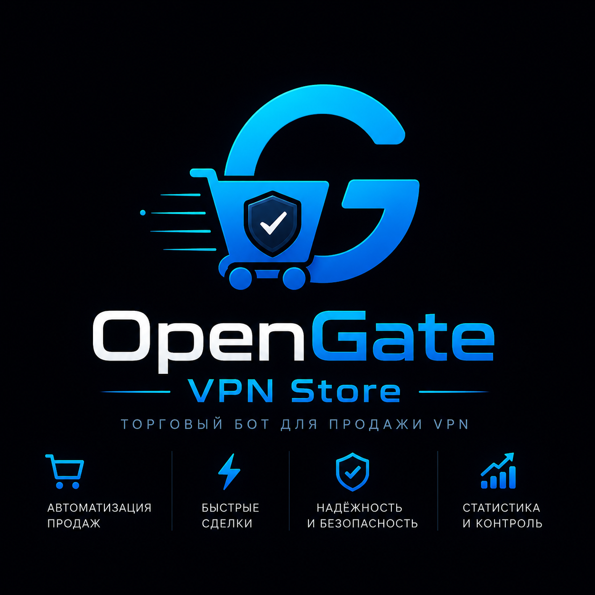

<p align="center">
  
</p>

<h1 align="center">OpenGate</h1>

<p align="center">
  <b>Telegram-бот для продажи VPN «под ключ»: приём оплаты, автовыдача ключей, админка, рефералка и промокоды.</b>
</p>

<p align="center">
  
  
  
  
  
</p>

<p align="center">
  <b>Русский</b> · <a href="README.en.md">English</a>
</p>

---

## Что это

OpenGate превращает Telegram-бота в полноценный магазин VPN-подписок. Пользователь выбирает
тариф, платит удобным способом и **сразу получает рабочий ключ** — без участия администратора.
Бот сам продлевает подписки, считает трафик, начисляет реферальные вознаграждения и синхронизирует
состояние с VPN-панелью.

Бот — **единственный источник правды** по срокам и лимитам: данные на панели приводятся к состоянию
базы, а не наоборот.

## Содержание

- [Возможности](#возможности)
- [Быстрый старт](#быстрый-старт)
- [Команды](#команды)
- [Как это работает](#как-это-работает)
- [Эксплуатация](#эксплуатация)
- [Проверка сборки](#проверка-сборки)
- [Документация](#документация)

## Возможности

### Платежи

| Способ | Особенности |
| :--- | :--- |
| **Cardlink** (карты/СБП) | Рекомендуемый: возврат в бота по deep-link, автопроверка статуса |
| **ЮKassa** | Telegram Payments и прямой QR/REST без вебхуков |
| **WATA**, **Platega** | Российский эквайринг: карты и СБП по QR |
| **Telegram Stars** | Оплата звёздами внутри Telegram |
| **CryptoBot**, **Heleket** | Крипта с вебхуками и мгновенным зачислением |
| **Свой крипто-процессор** | Подпись HMAC-SHA256, deep-link callback |
| **Внутренний баланс** | Пополнение, частичная и полная оплата, автопродление |

### VPN-панели

- **3x-UI** — основной путь: покупка, продление, subscription-режим, синхронизация трафика
- **Marzban** — user-centric REST, `subscription_url`, push срока и лимита
- **Naive** — Caddy Admin API или SSH-merge `users.conf`
- **mieru** — частичный апдейт users JSON + `mita apply` (без затирания)

### Продажи и маркетинг

- **Промокоды** четырёх типов: дни, процент скидки, баланс, триал
- **Рефералка до 3 уровней** — дни к ключу или деньги на баланс, индивидуальные коэффициенты
- **Пробная подписка** с гейтом по подписке на канал
- **Рекламные кампании** с UTM-метками и статистикой переходов
- **Рассылки** и уведомления об истечении подписки

### Ключи и трафик

- Лимиты трафика на тариф, **перенос остатка** при смене сервера
- Ежемесячный автосброс и уведомления при остатке 10 / 5 / 3 %
- Группы серверов и тарифов — изоляция предложений друг от друга
- Переименование, замена сервера, история платежей

### Администрирование

- Админка целиком в Telegram: серверы, тарифы, пользователи, оплаты, тексты
- **Редактор сообщений с превью** — что видите, то получит пользователь; поддержка фото
- **Бэкапы** ежедневно в 03:05: ZIP в Telegram + локальные `.db` с ротацией 7 дней
- **Обновление из GitHub** прямо из бота: обычные, блокирующие (`!`) и бета (`?`) коммиты
- Скачивание и очистка логов, статистика, поиск пользователей

## Быстрый старт

### Вариант 1. VPS + systemd (продакшен)

Нужен VPS с Ubuntu, минимум 1 vCPU / 1 GB RAM / 10 GB SSD и установленная VPN-панель.

```bash
git clone https://github.com/Burashka44/OpenGate.git /opt/OpenGate
cd /opt/OpenGate
sudo bash install.sh
```

Выберите **1) Установка** и введите `BOT_TOKEN` (от [@BotFather](https://t.me/BotFather)) и свой
Telegram ID. Скрипт создаст venv, пользователя `opengate` и systemd-юнит.

```bash
systemctl status opengate      # статус
journalctl -u opengate -f      # логи
sudo bash install.sh update    # обновление
```

### Вариант 2. Docker Compose

```bash
cp .env.example .env    # укажите BOT_TOKEN и ADMIN_IDS
docker compose up -d --build
docker compose logs -f
```

База и логи сохраняются в `./database` и `./logs` между перезапусками.

### Дальше

1. Откройте бота → **Админ-панель**.
2. Добавьте VPN-сервер — перед сохранением обязателен успешный тест подключения.
3. Создайте тарифы.
4. Включите оплаты и впишите ключи по **[INTEGRATIONS.md](INTEGRATIONS.md)**.
5. Пройдите **[SMOKE_CHECKLIST.md](SMOKE_CHECKLIST.md)** перед первыми продажами.

> [!IMPORTANT]
> `config.py`, `.env` и база данных в `.gitignore` — секреты не попадут в репозиторий.

## Команды

### Пользователь

| Команда | Описание |
| :--- | :--- |
| `/start` | Главная: приветствие и список тарифов |
| `/mykeys` | Мои ключи: статус, трафик, продление |
| `/promo` | Активировать промокод |
| `/topup` | Пополнить внутренний баланс |
| `/help` | Справка |

### Администратор

| Команда | Описание |
| :--- | :--- |
| `/ops` | Сводка операционных настроек |
| `/ops_set КЛЮЧ ЗНАЧЕНИЕ` | Изменить настройку из белого списка |
| `/maintenance on\|off` | Режим обслуживания: блокирует покупки и продления |
| `/promo_add`, `/promo_list`, `/promo_del` | Управление промокодами |
| `/promo_on`, `/promo_off` | Включить или выключить промокод |
| `/ad_add`, `/ad_list`, `/ad_del` | Рекламные кампании и UTM |
| `/update` | Обновление кода из GitHub |

> [!TIP]
> В меню [@BotFather](https://t.me/BotFather) добавляйте только пользовательские команды —
> админские в публичном списке не нужны.

## Как это работает

```
Telegram ──> aiogram 3 (polling) ──> SQLite (WAL, автомиграции)
                  │                        │
                  │                        └─> ключи, платежи, промо, рефералка
                  ├─> платёжные API ──> подтверждение ──> выдача ключа
                  ├─> VPN-панель (3x-UI / Marzban / Naive / mieru)
                  └─> aiohttp: /sub, вебхуки, /healthz
```

Надёжность денежного контура:

- **Идемпотентность** — повторный вебхук или клик «Я оплатил» не выдаёт ключ и рефералку дважды
- **Webhook outbox** — исходящие события с повторными попытками
- **Circuit breaker** — панель, которая падает, временно исключается из запросов
- **Healthcheck** панелей и авто-maintenance при полном отказе

## Эксплуатация

Встроенный веб-сервер выключен по умолчанию. Включается настройкой `web_enabled=1`
(порт `web_port`, наружу — через nginx/caddy):

| Маршрут | Назначение |
| :--- | :--- |
| `/healthz` | Проба живости |
| `/sub/{token}` | Брендированная страница подписки |
| `/webhook/cryptobot`, `/webhook/heleket` | Приём платёжных вебхуков |

Опционально FSM можно перенести в Redis — задайте `redis_fsm_url`, чтобы состояния диалогов
не терялись при перезапуске.

## Проверка сборки

Перед деплоем прогоняются автопроверки: схема БД, критичные импорты, денежная арифметика,
подписи вебхуков, circuit breaker.

```bash
python verify_audit.py        # интеграционные проверки
python verify_audit_deep.py   # скидки, ордера, идемпотентность
python -m pytest tests -q     # моки панелей
```

## Документация

| Файл | О чём |
| :--- | :--- |
| **[ADMIN_GUIDE.md](ADMIN_GUIDE.md)** | Ручная установка, админка, бэкапы, синхронизация, тексты |
| **[INTEGRATIONS.md](INTEGRATIONS.md)** | Все внешние сервисы, ключи `settings`, чеклист первого запуска |
| **[SMOKE_CHECKLIST.md](SMOKE_CHECKLIST.md)** | Что проверить перед продакшеном |

---

<p align="center">
  <sub>Перед публичным запуском замените демо-значения бренда, донат-ссылки и
  <code>GITHUB_REPO_URL</code> на свои — см. раздел «Брендинг» в INTEGRATIONS.md.</sub>
</p>
